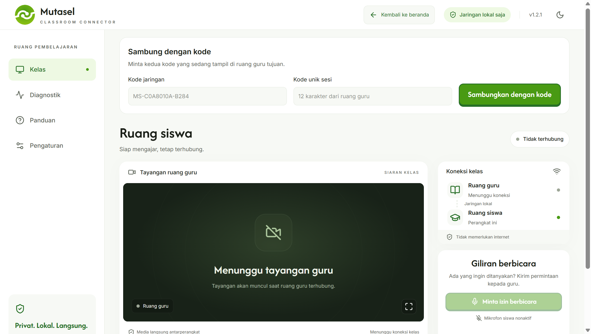
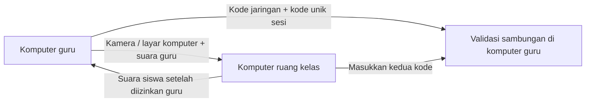

<div align="center">
  
  <h1>Mutasel: Classroom Connector</h1>
  <p><strong>Dua ruang. Satu pembelajaran.</strong></p>
  <p>Hubungkan ruang guru dan ruang kelas melalui jaringan sekolah.<br />Tayangkan kamera, bagikan layar, dan atur giliran berbicara tanpa koneksi internet.</p>
  <p><strong>Windows x64 · LAN / Wi-Fi lokal · Kode sesi unik · Tanpa cloud</strong></p>
  <p>
    <a href="https://github.com/GHXZY/Mutasel/releases">Lihat rilis</a> ·
    <a href="#instalasi">Instalasi</a> ·
    <a href="#setup-pertama">Setup pertama</a> ·
    <a href="#mengatasi-kendala">Mengatasi kendala</a> ·
    <a href="https://github.com/GHXZY/Mutasel/issues">Laporkan masalah</a>
  </p>
</div>

---

## Tentang Mutasel

**Mutasel** adalah aplikasi desktop untuk komunikasi langsung antara satu ruang guru dan satu ruang kelas. Guru dapat menjelaskan materi melalui kamera dan mikrofon, atau menampilkan layar komputer untuk presentasi. Siswa mendengarkan melalui speaker dan dapat meminta izin untuk berbicara.

Aplikasi berjalan melalui **jaringan lokal sekolah**. Setelah terpasang, Mutasel tidak memerlukan akun, langganan layanan cloud, atau koneksi internet untuk menjalankan sesi. Kedua komputer tetap harus terhubung ke LAN atau Wi-Fi yang saling dapat dijangkau.

**Versi saat ini: 1.2.0.** Setiap sesi menghubungkan **satu komputer guru dan satu komputer ruang kelas**. Beberapa pasangan ruang dapat memakai jaringan yang sama, dengan kode sesi masing-masing. Satu sesi belum mendukung banyak komputer siswa sekaligus.



## Fitur utama

| Fitur                            | Manfaat                                                             |
| -------------------------------- | ------------------------------------------------------------------- |
| **Kamera dan suara guru**        | Sampaikan pembelajaran secara langsung ke ruang kelas.              |
| **Presentasi layar komputer**    | Tampilkan slide, dokumen, atau aplikasi dari monitor guru.          |
| **Sambungan dua kode**           | Pilih komputer guru tujuan dengan kode jaringan dan kode unik sesi. |
| **Izin berbicara siswa**         | Guru dapat mengizinkan, menolak, atau mengakhiri giliran berbicara. |
| **Kontrol perangkat dan volume** | Pilih mikrofon, kamera, speaker, serta atur volume 0–100%.          |
| **Layar penuh**                  | Perbesar tayangan untuk monitor atau proyektor kelas.               |
| **Kembali ke beranda**           | Akhiri sesi lalu pilih kembali peran ruang guru atau ruang kelas.   |
| **Diagnostik koneksi**           | Periksa status sambungan, media, dan informasi jaringan.            |
| **Tema terang dan gelap**        | Sesuaikan tampilan dengan kondisi ruangan.                          |

## Bagaimana sistem bekerja?

Komputer guru menjalankan layanan penghubung lokal. Ruang kelas memasukkan dua kode dari guru, kemudian layanan tersebut memeriksa kecocokannya sebelum mengizinkan sambungan. Setelah terhubung, audio dan video mengalir langsung antara kedua komputer menggunakan **WebRTC**.



- **Guru → ruang kelas:** video kamera atau layar komputer, disertai suara mikrofon guru.
- **Ruang kelas → guru:** suara mikrofon siswa hanya setelah guru memberikan izin. Kamera siswa tidak digunakan.
- **Presentasi:** layar komputer menggantikan tayangan kamera. Suara tetap berasal dari mikrofon guru; **audio sistem komputer belum ikut dibagikan**.
- **Gangguan jaringan singkat:** aplikasi mencoba menyambung ulang ke sesi yang sama. Izin berbicara siswa dinonaktifkan saat pemulihan.

### Dua kode, satu tujuan

| Kode               | Fungsi                                                                                                     | Kapan berubah?                                 |
| ------------------ | ---------------------------------------------------------------------------------------------------------- | ---------------------------------------------- |
| **Kode jaringan**  | Menunjuk alamat jaringan dan port komputer guru. Format: `MS-XXXXXXXX-XXXX`.                               | Ketika alamat jaringan atau port guru berubah. |
| **Kode unik sesi** | Memastikan ruang kelas bergabung ke sesi guru yang dimaksud. Terdiri dari 12 karakter huruf A–F dan angka. | Ketika guru memulai sesi baru.                 |

Sesi baru dimulai saat guru kembali ke beranda lalu membuka **Ruang guru**, membuka ulang aplikasi guru, atau mengubah port guru. **Kode unik sesi lama tidak berlaku lagi.** Minta kedua kode terbaru sebelum menyambung kembali.

Jika komputer guru memiliki beberapa koneksi jaringan, aplikasi menampilkan kode untuk setiap adapter. Pilih kode LAN atau Wi-Fi yang juga dapat dijangkau komputer ruang kelas. Kode jaringan Mutasel bukan kata sandi Wi-Fi.

## Apa saja yang dibutuhkan?

| Kebutuhan               | Komputer guru                                                | Komputer ruang kelas                               |
| ----------------------- | ------------------------------------------------------------ | -------------------------------------------------- |
| **Komputer**            | PC atau laptop Windows 64-bit                                | PC atau laptop Windows 64-bit                      |
| **Aplikasi**            | Mutasel versi yang sama dengan ruang kelas                   | Mutasel versi yang sama dengan guru                |
| **Jaringan**            | Ethernet atau Wi-Fi lokal                                    | Jaringan lokal yang dapat menjangkau komputer guru |
| **Mikrofon**            | Untuk menyampaikan materi                                    | Untuk berbicara setelah mendapat izin              |
| **Speaker / headset**   | Untuk mendengar tanggapan siswa                              | Untuk mendengar suara guru                         |
| **Kamera**              | Untuk tayangan guru; tidak wajib jika hanya presentasi layar | Tidak diperlukan                                   |
| **Monitor / proyektor** | Monitor komputer                                             | Monitor, TV, atau proyektor sesuai kebutuhan kelas |

Gunakan **Ethernet** bila tersedia. Pada Wi-Fi, hindari jaringan tamu yang membatasi komunikasi antarperangkat. Kualitas suara dan gambar bergantung pada perangkat serta kondisi jaringan; spesifikasi minimum CPU/RAM belum ditetapkan melalui uji perangkat sekolah.

Installer sudah membawa komponen aplikasi. Komputer pengguna **tidak perlu memasang Node.js, npm, atau Python**. Internet hanya diperlukan untuk memperoleh installer, bukan untuk menjalankan sesi lokal.

## Instalasi

1. Buka halaman [Releases](https://github.com/GHXZY/Mutasel/releases) dan cari installer versi yang akan digunakan.
2. Untuk versi 1.2.0, nama berkasnya adalah **`Mutasel-Classroom-Connector-Setup-1.2.0.exe`**.
3. Jalankan installer pada komputer guru dan komputer ruang kelas, lalu ikuti petunjuk pemilihan lokasi instalasi.
4. Buka **Mutasel Classroom Connector** dari shortcut Windows.
5. Jika Windows meminta izin jaringan, izinkan aplikasi pada jaringan **Private** sekolah yang dipercaya.

Jika installer belum tersedia di Releases, minta berkas dari pengelola aplikasi atau ikuti bagian [menjalankan dari source](#menjalankan-dari-source). Installer saat ini belum ditandatangani dengan sertifikat penerbit; gunakan berkas dari sumber yang dapat dipercaya dan ikuti kebijakan TI sekolah jika Windows membatasinya.

Untuk memperbarui aplikasi, tutup Mutasel lalu jalankan installer versi baru di **kedua komputer**. Jangan mencampurkan versi lama tanpa fitur kode sesi dengan versi 1.2.0.

## Setup pertama

### 1. Siapkan jaringan dan perangkat

1. Hubungkan kedua komputer ke LAN atau Wi-Fi sekolah yang saling dapat dijangkau.
2. Sambungkan mikrofon, speaker, dan kamera yang akan digunakan.
3. Pastikan Windows mengizinkan aplikasi desktop mengakses mikrofon dan kamera.
4. Atur keluaran Windows ke speaker atau headset yang sesuai.

### 2. Buka ruang guru

1. Pada beranda Mutasel, pilih perangkat **Ruang guru**.
2. Buka **Pengaturan → Perangkat**, pilih kamera, mikrofon, dan speaker, lalu simpan.
3. Periksa pratinjau kamera. Jika koneksi belum dimulai, tekan **Hubungkan**.
4. Catat **Kode jaringan** dan **Kode unik sesi** yang tampil di bagian atas halaman Kelas.
5. Berikan kedua kode kepada operator ruang kelas tujuan. Biarkan aplikasi guru tetap terbuka.

### 3. Sambungkan ruang kelas

1. Pada komputer ruang kelas, pilih perangkat **Ruang siswa**.
2. Di formulir **Sambung dengan kode**, masukkan **Kode jaringan** dan **Kode unik sesi** dari guru.
3. Klik **Sambungkan dengan kode** dan tunggu status **Terhubung**.
4. Pilih speaker yang sesuai melalui **Pengaturan → Perangkat**. Atur **Volume speaker** di halaman Kelas.
5. Pastikan tayangan dan suara guru diterima sebelum pembelajaran dimulai.

> Kode kosong, salah, atau berasal dari sesi lama akan ditolak. Komputer ruang kelas tidak otomatis memilih guru pertama yang ditemukan di jaringan.

### 4. Uji komunikasi singkat

1. Minta guru berbicara dan pastikan suaranya terdengar di ruang kelas.
2. Di ruang kelas, tekan **Minta izin berbicara**.
3. Di komputer guru, pilih **Izinkan**. Minta siswa berbicara untuk menguji suara balik.
4. Tekan **Selesai berbicara** di ruang kelas atau **Akhiri izin bicara** di komputer guru.

## Saat pembelajaran berlangsung

| Kegiatan                         | Langkah                                                                                                                                            |
| -------------------------------- | -------------------------------------------------------------------------------------------------------------------------------------------------- |
| **Menampilkan layar guru**       | Klik **Mode presentasi**, pilih monitor, lalu buka materi yang ingin ditampilkan. Seluruh tampilan monitor pilihan akan terlihat oleh ruang kelas. |
| **Kembali ke kamera**            | Klik **Hentikan presentasi**.                                                                                                                      |
| **Memperbesar tayangan**         | Klik tombol fullscreen pada video. Klik tombol keluar atau tekan **Esc** untuk kembali.                                                            |
| **Memperbesar seluruh aplikasi** | Tekan **F11**.                                                                                                                                     |
| **Mengatur suara**               | Geser **Volume speaker** dari 0–100% atau gunakan tombol mute.                                                                                     |
| **Mengganti perangkat**          | Buka **Pengaturan → Perangkat**, pilih perangkat, lalu simpan.                                                                                     |
| **Memulai sesi atau peran baru** | Klik **Kembali ke beranda**, pilih peran, dan bagikan kode terbaru jika menjadi guru.                                                              |
| **Menutup sesi guru**            | Kembali ke beranda atau tutup aplikasi guru. Layanan guru tidak berjalan tersembunyi di tray.                                                      |

## Mengatasi kendala

Mulai dengan memastikan **versi aplikasi sama**, guru masih membuka sesi yang dimaksud, dan kedua kode disalin dari tampilan guru terbaru.

| Kendala                                                   | Langkah pemeriksaan                                                                                                                                                                 |
| --------------------------------------------------------- | ----------------------------------------------------------------------------------------------------------------------------------------------------------------------------------- |
| **Kode tidak cocok / kode lama ditolak**                  | Salin ulang kedua kode. Jika guru baru membuka ulang aplikasi, kembali ke beranda, atau mengganti port, gunakan kode unik baru.                                                     |
| **Kode jaringan tidak muncul**                            | Periksa sambungan LAN/Wi-Fi guru. Aplikasi membutuhkan alamat IPv4 lokal. Jika koneksi jaringan baru berubah, kembali ke beranda lalu buka ruang guru agar informasinya diperbarui. |
| **Terus menghubungkan atau gagal tersambung**             | Pastikan kode jaringan berasal dari adapter yang dapat dijangkau ruang kelas. Periksa LAN, izin Firewall, jaringan tamu, dan isolasi klien Wi-Fi.                                   |
| **Perangkat sudah terhubung / slot terisi**               | Satu sesi hanya menerima satu komputer ruang kelas. Putuskan sambungan ruang kelas sebelumnya sebelum menggantinya.                                                                 |
| **Status jaringan aktif tetapi video/suara tidak muncul** | Buka **Diagnostik** dan periksa status WebRTC. Minta pengelola jaringan memeriksa lalu lintas UDP media; membuka port penghubung saja belum cukup.                                  |
| **Kamera atau mikrofon tidak tersedia**                   | Periksa izin privasi Windows, sambungan USB, dan pilihan perangkat. Tutup aplikasi lain yang sedang memakai perangkat, lalu pilih ulang melalui Pengaturan.                         |
| **Suara guru tidak terdengar**                            | Periksa mute dan volume mikrofon guru, volume speaker ruang kelas, perangkat keluaran Windows, serta **Tes speaker** di Pengaturan.                                                 |
| **Suara siswa tidak terdengar**                           | Pastikan guru sudah mengizinkan siswa berbicara. Periksa mikrofon siswa dan speaker guru. Setelah koneksi terputus, siswa perlu meminta izin lagi.                                  |
| **Suara bergema atau terlambat**                          | Jauhkan mikrofon dari speaker atau gunakan headset. Coba perangkat audio kabel jika Bluetooth menambah keterlambatan.                                                               |
| **Video tersendat**                                       | Coba Ethernet, kurangi lalu lintas jaringan lain, dan tutup aplikasi berat. Lihat informasi koneksi di Diagnostik.                                                                  |
| **Presentasi tidak mengirim suara video komputer**        | Presentasi saat ini mengirim gambar layar dan suara mikrofon guru. Audio sistem belum didukung.                                                                                     |
| **Jaringan sempat terputus**                              | Pulihkan LAN/Wi-Fi dan tunggu upaya sambung ulang. Jika sesi guru sudah diganti, masukkan kode terbaru lalu sambungkan kembali.                                                     |
| **Port guru sedang digunakan**                            | Ubah port melalui **Pengaturan → Jaringan** pada komputer guru. Setelah disimpan, bagikan kedua kode baru; ruang kelas tidak perlu mengisi port secara terpisah.                    |

### Pengaturan jaringan untuk pengelola TI

Izinkan **`Mutasel Classroom Connector.exe`** pada profil jaringan **Private** di kedua komputer melalui Windows Firewall. Gunakan aturan program dengan cakupan jaringan lokal sesuai kebijakan sekolah; tidak perlu mematikan Firewall keseluruhan.

| Jalur                       | Port / protokol                     | Keterangan                                                                             |
| --------------------------- | ----------------------------------- | -------------------------------------------------------------------------------------- |
| Penghubung dan kontrol sesi | TCP **45700** secara default        | Port dapat diubah di komputer guru; kode jaringan ikut menyesuaikan.                   |
| Audio dan video WebRTC      | UDP **port dinamis**                | Komunikasi langsung antara kedua komputer.                                             |
| Discovery lokal             | UDP **45701** dan mDNS UDP **5353** | Komponen penemuan perangkat; sambungan dua kode tidak bergantung pada hasil discovery. |

Pastikan Wi-Fi tidak mengaktifkan **AP/client isolation** untuk kedua perangkat. Jika komputer berada di VLAN berbeda, pengelola jaringan perlu memeriksa routing dan aturan akses antar-VLAN. Versi ini memakai IPv4 privat (`10.x.x.x`, `172.16.x.x`–`172.31.x.x`, atau `192.168.x.x`); jaringan IPv6-only belum didukung.

### Masih mengalami masalah?

Buka [GitHub Issues](https://github.com/GHXZY/Mutasel/issues) dan sertakan:

- Versi Mutasel dan Windows pada kedua komputer.
- Peran perangkat, jenis koneksi Ethernet/Wi-Fi, serta mikrofon/kamera/speaker yang dipakai.
- Langkah yang menyebabkan masalah, hasil yang diharapkan, dan pesan kesalahan.
- Informasi dari halaman **Diagnostik** atau tangkapan layar yang relevan.

Hapus kode sesi aktif dan informasi pribadi dari laporan publik. Jangan menyertakan rekaman atau data siswa untuk menjelaskan masalah teknis.

## Data dan privasi

Mutasel tidak menyediakan perekaman audio/video, penyimpanan media di cloud, atau analytics. Pengaturan perangkat disimpan secara lokal di `%APPDATA%/local-classroom/settings.json`. Riwayat diagnostik dibatasi di memori dan tidak ditulis sebagai log sesi ke disk.

Media WebRTC memakai enkripsi bawaan DTLS-SRTP. Signaling lokal menggunakan WebSocket tanpa TLS. **Kode sesi membantu mencegah salah sambung; aplikasi tetap ditujukan untuk LAN sekolah yang dipercaya.**

## Untuk pengembang

### Menjalankan dari source

Siapkan Windows, **Node.js 22 atau lebih baru**, npm, dan Git jika menggunakan perintah clone. Koneksi internet diperlukan untuk mengambil source dan dependency.

```powershell
git clone https://github.com/GHXZY/Mutasel.git
cd Mutasel
npm ci
npm run dev
```

Untuk menjalankan hasil build lokal:

```powershell
npm run build
npm start
```

Preview di browser hanya untuk tampilan. Gunakan aplikasi Electron untuk server guru, media desktop, dan sambungan kelas.

### Membuat installer Windows

```powershell
npm run dist
```

Hasil versi 1.2.0:

```text
release/
├── Mutasel-Classroom-Connector-Setup-1.2.0.exe
└── win-unpacked/
    └── Mutasel Classroom Connector.exe
```

Folder `release/` adalah hasil build lokal dan tidak disimpan di Git. Distribusikan installer melalui GitHub Releases. Jika menggunakan versi `win-unpacked`, seluruh isi folder pendukung harus ikut disalin, bukan hanya EXE-nya.

### Teknologi dan struktur proyek

**Electron · React · TypeScript · Vite · Tailwind CSS · Fastify · WebSocket · WebRTC · Zod**

```text
apps/desktop/
├── electron/       # Jendela desktop, IPC, izin perangkat, dan settings
└── renderer/       # Antarmuka, kontrol media, dan koneksi WebRTC
packages/
├── signaling/      # Server lokal, validasi sesi, dan izin berbicara
└── shared/         # Skema data dan protokol bersama
tests/              # Pengujian server dan dua proses Electron
scripts/            # Build, packaging, dan pemeriksaan aplikasi
docs/               # Arsitektur, hasil verifikasi, dan checklist lapangan
```

### Menjalankan pengujian

```powershell
npm test
npm run build
npm run test:e2e
```

Setelah membuat installer, periksa aplikasi hasil paket:

```powershell
node scripts/packaged-smoke.mjs
```

## Status pengujian dan dokumentasi

Versi 1.2.0 telah melewati **7 pengujian server/protokol**, pengujian dua proses Electron, dan pemeriksaan startup aplikasi hasil paket. Cakupannya termasuk kode salah/kedaluwarsa, pemisahan sesi guru, izin bicara, media, presentasi, fullscreen, volume, dan sambung ulang.

Pengujian media menggunakan perangkat simulasi pada satu komputer Windows 11. Pengujian tersebut belum menggantikan uji dua komputer fisik, Windows 10, kualitas suara di ruang kelas, serta sesi panjang di jaringan sekolah.

- [Arsitektur sistem](docs/ARCHITECTURE.md)
- [Hasil verifikasi dan batas pengujian](docs/VERIFICATION.md)
- [Checklist pengujian di sekolah](docs/MANUAL-TESTS.md)

---

<div align="center">
  <strong>Mutasel: Classroom Connector</strong><br />
  Komunikasi kelas melalui jaringan sekolah Anda.
</div>
